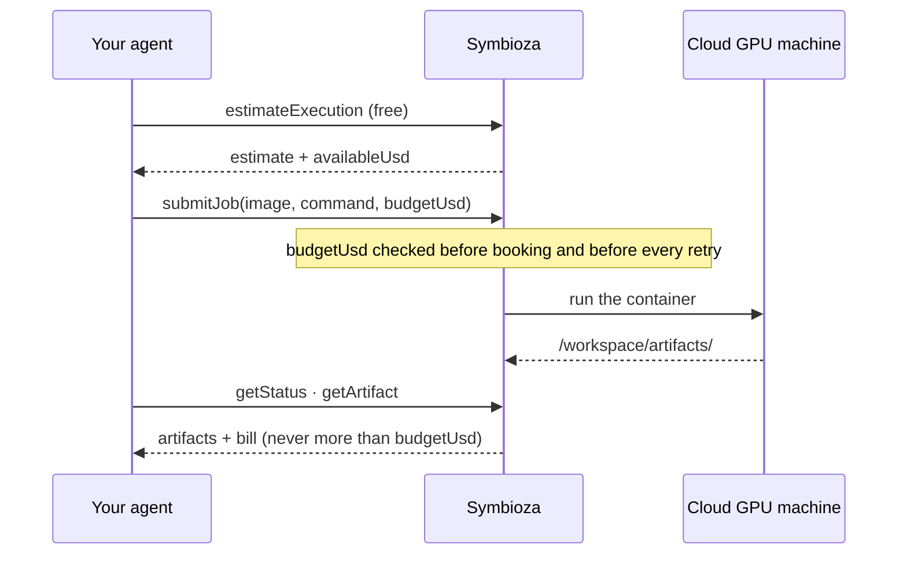

<p align="center">
  <picture>
    <source media="(prefers-color-scheme: dark)" srcset="assets/symbioza-logo-dark.png">
    
  </picture>
</p>
<p align="center">
  <a href="LICENSE"></a>
  <a href="https://symbioza.dev/agent"></a>
  
</p>

# Symbioza for Claude Code

Symbioza runs a containerized GPU job on a rented cloud machine under a hard dollar ceiling and collects available artifacts. An agent submits an image, a command and a budget through one MCP connector. Symbioza selects compute, runs the job and reports output delivery and billing separately. Recovery depends on job policy, available compute, remaining budget and compatible checkpoint support.

## Install


```sh
claude plugin marketplace add symbioza/claude-plugin
claude plugin install symbioza@symbioza
```

Or both at once from inside a Claude Code session: `/plugin install symbioza --marketplace symbioza/claude-plugin`.

## How it works



## What it adds

- **The Symbioza MCP connector** at https://symbioza.dev/mcp (streamable HTTP, OAuth). Its tools:
  `estimateExecution`, `submitJob`, `getStatus`, `getArtifact`, `listJobs`, `describeDataset`, `cancelJob`.
- **One skill, `run-on-symbioza`.** It tells your agent when a job no longer fits where it is running — it
  needs a GPU, the data is too big for local disk, it runs overnight, or you want a hard dollar cap — what to
  ask you, and the four calls from spec to artifacts: estimate, submit, status, artifact.

You describe the job: the image, the command, its inputs, the expected outputs and the most you will spend.
Symbioza sizes the machine; you never pick a GPU, a provider or a region. Whatever the run writes to
`/workspace/artifacts/` comes back.

## Sign in, then top up

Two gates: an account, and money in it.

- **Sign in.** The first tool call opens a browser sign-in — Google, GitHub or an email address. There is no
  key to generate and none to send. If Claude Code lists the server as needing authentication, run `/mcp`
  and pick symbioza.
- **Top up.** A new account can connect, estimate for free and read its own job list; `submitJob` refuses —
  “prepaid balance: $0.00 available … Top up, or lower the budget.” — until the account holds credit. Top up
  at https://symbioza.dev/app/topup — sign in and add credit; the page lists the ways to pay. Or write to
  access@symbioza.dev with the amount.

The budget you set is a hard ceiling: you are never billed more than that.

Already added the connector with `claude mcp add`? Remove that copy (`claude mcp remove symbioza`) so your
agent does not see every tool twice.

## More

- For agents deciding whether a job fits: https://symbioza.dev/agent
- Privacy: https://symbioza.dev/privacy.html · Terms: https://symbioza.dev/terms.html

## License

MIT — see [LICENSE](./LICENSE). The license covers this plugin's files only.
