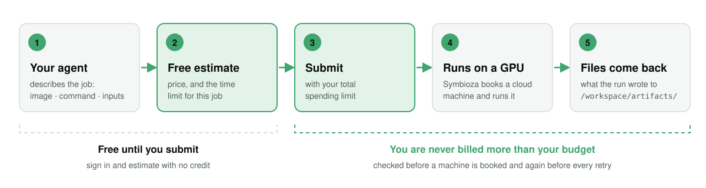

<p align="center">
  <picture>
    <source media="(prefers-color-scheme: dark)" srcset="assets/symbioza-logo-dark.png">
    
  </picture>
</p>
<p align="center">
  <a href="LICENSE"></a>
  <a href="https://github.com/symbioza/claude-plugin/releases"></a>
  <a href="https://symbioza.dev/agent"></a>
  <a href="#1-install"></a>
</p>

# Symbioza for Claude Code

**Run fine-tuning, evaluation and batch-inference jobs on a cloud GPU from Claude Code, under a hard spending
limit.** Your agent prepares the job, shows you a free estimate, and submits it only when you say so. Symbioza
picks the machine, runs the job and returns the files it writes. You are never billed more than the spending
limit you set.

<p align="center">
  <picture>
    <source media="(prefers-color-scheme: dark)" srcset="assets/how-it-works-dark.svg">
    
  </picture>
</p>

## What the plugin adds

Symbioza runs a containerized GPU job on a rented cloud machine under a hard dollar ceiling and collects available artifacts. An agent submits an image, a command and a budget through one MCP connector. Symbioza selects compute, runs the job and reports output delivery and billing separately. Recovery depends on job policy, available compute, remaining budget and compatible checkpoint support.

- **A hosted MCP server** at https://symbioza.dev/mcp (streamable HTTP, sign-in with OAuth, no API key). Its
  seven tools: `estimateExecution`, `submitJob`, `getStatus`, `getArtifact`, `listJobs`, `describeDataset`,
  `cancelJob`.
- **One skill, `/symbioza:run-on-symbioza`.** It tells your agent when a job fits Symbioza, what to ask you, and
  the four calls from spec to files: estimate, submit, status, artifact.

For agents deciding whether a job fits: https://symbioza.dev/agent

## 1. Install

```sh
claude plugin marketplace add symbioza/claude-plugin
claude plugin install symbioza@symbioza
```

Or both at once from inside a Claude Code session (Claude Code v2.1.275 or later):
`/plugin install symbioza --marketplace symbioza/claude-plugin`. Tested with Claude Code 2.1.283.

From the shell, the install ends with `Successfully installed plugin: symbioza@symbioza`: start a new Claude
Code session to use it. Installed from inside a session, Claude Code says either `Plugin is now active.` or
`Run /reload-plugins to activate.` (then run `/reload-plugins`).

## 2. Sign in

The connector needs signing in once before its tools appear. Run `/mcp`, select `plugin:symbioza:symbioza`
and choose **Authenticate**: your browser opens to sign in with Google, GitHub or an email address. There is no
key to generate and none to send.

## 3. Check it's connected

You are ready when all three hold:

- `/mcp` lists `plugin:symbioza:symbioza` as connected, with seven tools.
- Typing `/` shows `/symbioza:run-on-symbioza`.
- `claude plugin list` shows `symbioza@symbioza` as enabled.

Already added the connector with `claude mcp add`? Remove that copy (`claude mcp remove symbioza`) so your
agent does not see every tool twice.

## 4. Get a free estimate

Paste this, or run `/symbioza:run-on-symbioza`:

> Help me prepare this GPU job for Symbioza. Ask for the container image, command, input data, expected
> output files and my total spending limit. Check that the workload fits the current service limits. Show me
> a free estimate and anything missing. Do not submit the job yet.

The estimate shows the expected price, **the time limit that applies to this job**, the credit on your account
and whether it covers the job. Worked specs for fine-tuning, evaluation and batch inference:
https://symbioza.dev/examples

## 5. Add credit and submit

Two gates: an account, and money in it. A new account can connect, estimate and read its own job list;
submitting refuses — “prepaid balance: $0.00 available … Top up, or lower the budget.” — until the account holds
credit. Add credit at https://symbioza.dev/app/topup: sign in, and the page lists the ways to pay. Credit packs
and billing details: https://symbioza.dev/pricing

When you are happy with the estimate, tell your agent to submit.

## What your agent will ask you for

- **A supported container image.** Symbioza runs images it has verified on its machines (today, PyTorch and
  TensorFlow images). Any other image is refused with the current list of supported images, before
  anything is booked or charged. A stock image does not contain your code, so the command must fetch your
  script and anything else it needs, for example from a URL.
- **A command** that runs the job, as you would type it in the container.
- **Inputs the machine can reach**: URLs it downloads itself, never files on your laptop. Use a signed link
  with the shortest expiry that covers staging.
- **Output files** written to `/workspace/artifacts/`. That directory is what comes back; anything written
  elsewhere is not collected.
- **A total spending limit** for the job, in US dollars.

## How runs, files and cancelling work

- **Time.** Every run has a time limit: what your spending limit buys on the machine it books and any cap you
  set, never more than the 48-hour platform maximum. The estimate shows that limit before you spend anything;
  the machine the job books can end a run sooner. A cap above 48 hours is refused at submit.
- **Files.** Check the file delivery status separately from the run status. Available output files have
  download links and hashes you can verify. A completed run does not by itself confirm file delivery or final
  billing. Download links expire after 24 hours; the files do not.
- **Recovery.** A retry or move to another machine depends on the job policy, available compute and what is left
  of your spending limit. Checkpoint recovery needs compatible save-and-resume logic in your code. A run may stop
  without completing.
- **Cancel.** Cancelling stops your job and ends its spend. On shared capacity it releases only your job's share.

## What you pay

- Estimates, status checks and your own job list are free.
- Submitted jobs use prepaid credit.
- A job that fails, or that you cancel, is billed for the machine time it used — never more than the spending
  limit you set.
- Your spending limit is a hard ceiling: you are never billed more than that. It is checked before a machine is
  booked and again before every retry. The charge shown after completion may change while billing is
  reconciled.

## Privacy

Jobs run on third-party compute. Your job's image, command, dataset links, environment variables and log tails
are processed on Symbioza's servers and can be stored, so keep secrets out of them: never put cloud-provider
keys, SSH private keys or other credentials in a job specification. Only submit code and data you have
permission to use.

Privacy: https://symbioza.dev/privacy · Terms: https://symbioza.dev/terms

## Update and uninstall

These commands update an existing install; installing for the first time, see step 1. Auto-update is off by
default for this marketplace. To update:

```sh
claude plugin marketplace update symbioza
claude plugin update symbioza@symbioza
```

The update ends with `Restart to apply changes.`: restart Claude Code to load the new version.

To uninstall:

```sh
claude plugin uninstall symbioza@symbioza
claude plugin marketplace remove symbioza
```

Uninstalling the plugin does not cancel jobs you already submitted and does not close your Symbioza account.
Cancel running jobs first (ask your agent, which calls `cancelJob`), and manage your account at
https://symbioza.dev/app.

## Get help

- **A problem installing or using the plugin:** open an issue at
  https://github.com/symbioza/claude-plugin/issues. Redact before you post: never paste tokens, keys, account
  details or private job data.
- **Your account, a payment, privacy or security:** use the contact form at https://symbioza.dev/contact.
- **Other clients** (ChatGPT, Claude, any remote MCP client): https://symbioza.dev/plugins

## Changes and license

Release notes: [CHANGELOG.md](./CHANGELOG.md). MIT — see [LICENSE](./LICENSE). The license covers this plugin's
files only.
